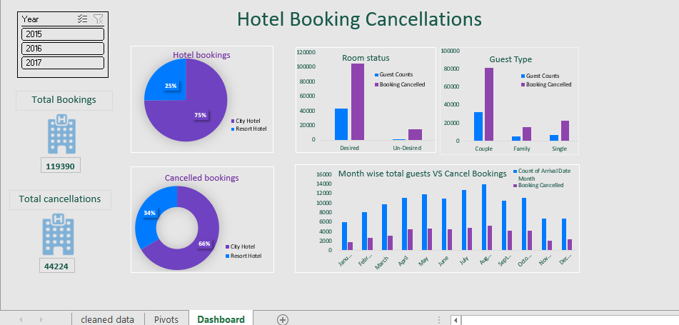

# 📊 Hotel Booking Cancellations Dashboard

This interactive Excel dashboard analyzes hotel booking data from 2015 to 2017, focusing on total bookings, cancellations, room preferences, guest types, and monthly trends. The visualization helps identify patterns in cancellations and guest behavior, enabling data-driven decisions in hospitality management.



---

## 🔍 Overview

This project showcases a comprehensive analysis of hotel booking and cancellation trends using Excel dashboards and pivot tables. The dataset includes bookings for City Hotels and Resort Hotels over three years.

**Key Highlights:**

* Total bookings and cancellations overview.
* Booking breakdown by hotel type.
* Room status preferences (Desired vs Undesired).
* Guest type behavior (Couple, Family, Single).
* Monthly trends of arrivals vs cancellations.

---

## 💡 Features

* 🗕️ **Year Filter** – Analyze data by selecting 2015, 2016, or 2017.
* 🏨 **Hotel Type Breakdown** – Compare bookings and cancellations for City vs Resort hotels.
* 📈 **Visual Analytics** – Use of pie charts, bar charts, and column plots for intuitive insights.
* 📊 **Room Status & Guest Type Trends** – Identify how room preferences and guest categories influence cancellations.
* 🗓 **Month-wise Analysis** – Understand seasonal booking patterns and cancellation spikes.

---

## 📁 Project Structure

```
Hotel_Booking_Dashboard/
│
├── cleaned_data/         # Raw & cleaned datasets
├── Pivots/               # Pivot tables used in the dashboard
├── Dashboard.png         # Image of the final dashboard
├── Dashboard.xlsx        # Excel dashboard file (not uploaded here)
└── README.md             # Project description and details
```

---

## 🛠 Tools & Skills Used

* **Excel**: Pivot Tables, Slicers, Charts
* **Data Analysis**: Trend identification, comparative analysis
* **Visualization**: Pie charts, bar plots, comparative visuals
* **Business Intelligence Concepts**: KPI analysis, cancellation rate tracking

---

## 📌 Key Insights

* City hotels had higher cancellation rates than resort hotels.
* Desired room types saw significantly higher bookings and cancellations.
* Couple guests dominated the bookings across all years.
* Cancellations were relatively higher in mid-year months (June–August).

---

## 👩‍💻 About Me
Humera Shaik
📊 Data Analyst | 🎯 Forecasting & Insight Generation | 🤖 AI Tools Explorer

📧 Email: humerah610@gmail.com

📱 Phone: +91 7382273550

🔗 [LinkedIn](https://www.linkedin.com/in/humera-shaik-dataanalyst/)
📄 [View My Resume](HS%20DA%2045.pdf)
